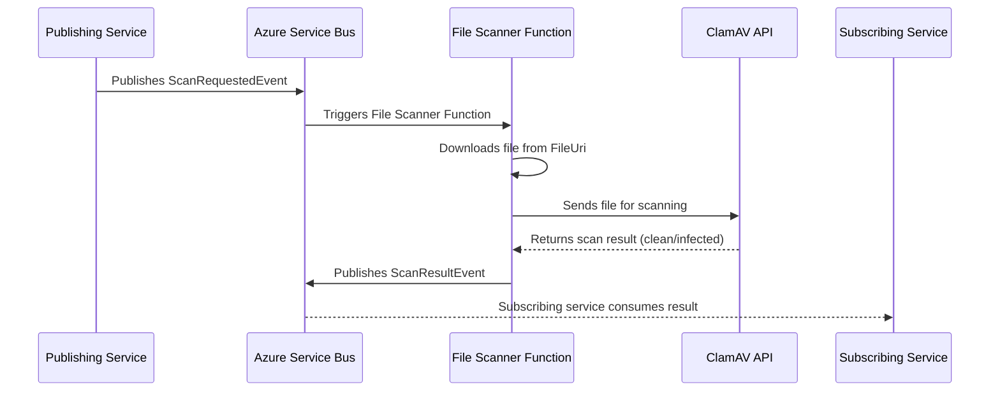

# ☁️ GovUK DfE File Scanner Function

The **File Scanner Function** is an event-driven Azure Function designed to scan files for viruses using the [ClamAV API](https://github.com/DFE-Digital/rsd-clamav-api).  

It listens for **file scan requests** on an Azure Service Bus topic, downloads the file (from Azure File Share or local storage), sends it to the ClamAV API for scanning, and publishes the **scan results** to a separate topic for any consuming service to process.

This service is part of the **DfE CoreLibs Virus Scanning Framework**, but can be used independently by any application that needs asynchronous, event-based virus scanning.

---

## 🚀 Features

- 📨 **Event-driven architecture** — reacts automatically to Service Bus messages.  
- 🔒 **ClamAV integration** — uses the containerised ClamAV API for scanning.  
- 💾 **Flexible file retrieval** — supports both Azure File Share and local file access.  
- ⚡ **Redis caching** — prevents duplicate scans for identical files.  
- 🧠 **Robust handling** — invalid or incomplete messages are dead-lettered automatically.  
- 🔄 **Event publishing** — publishes results to a dedicated topic, consumable by any service.  
- 🧩 **Framework-agnostic** — can be adopted by any system needing automated virus checks.

---

## 🧩 Architecture Overview

This function works alongside the [ClamAV API](https://github.com/DFE-Digital/rsd-clamav-api) to form a simple, event-driven virus scanning pipeline.

| Component | Role |
|------------|------|
| **File Scanner Function** | Listens to `file-scanner-requests`, downloads files, calls ClamAV API, and publishes scan results |
| **ClamAV API** | Containerised REST service that performs the actual virus scanning and database updates |

---

### 🧭 Process Flow

1. A service publishes a **`ScanRequestedEvent`** to the `file-scanner-requests` topic.  
2. The **File Scanner Function** receives the event and downloads the target file using its `FileUri`.  
3. The file is sent to the **ClamAV API** for virus scanning.  
4. The ClamAV API returns a result (`clean`, `infected`, or `error`).  
5. The Function publishes a **`ScanResultEvent`** to the `file-scanner-results` topic.  
6. Any subscribed service can consume this result and handle it accordingly (e.g. delete infected files, notify users, etc.).

---

### 🧩 System Flow Diagram

Below is the message flow between components:




## 📬 Message Contracts

### 📨 `ScanRequestedEvent`
Published by any service requesting a file scan.

```csharp
public record ScanRequestedEvent(
    string? FileId,
    string FileName,
    string? FileHash,
    string? Reference,
    string? Path,
    bool? IsAzureFileShare,
    string FileUri,
    string ServiceName,
    Dictionary<string, object>? Metadata);
```

---

### 🧾 `ScanResultEvent`
Published by the File Scanner Function once the scan completes.

```csharp
public record ScanResultEvent(
    string ServiceName,
    string FileUri,
    string FileName,
    string? FileId = null,
    string? Reference = null,
    string? Path = null,
    bool? IsAzureFileShare = null,
    string? CorrelationId = null,
    ScanStatus Status = ScanStatus.Completed,
    VirusScanOutcome? Outcome = null,    
    string? MalwareName = null,
    DateTimeOffset? ScannedAt = null,
    string? ScannerVersion = null,
    string? Message = null,             
    int? TimeoutSeconds = null,          
    string? VendorJobId = null,      
    Dictionary<string, object>? Metadata = null);
```

---

## ⚙️ Configuration

### Environment Variables

| Key | Description | Example |
|-----|--------------|----------|
| `TOPIC_NAME` | Topic to listen to for scan requests | `file-scanner-requests` |
| `SUBSCRIPTION_NAME` | Subscription name for the scanner | `file-scanner-function` |
| `VirusScannerApi:BaseUrl` | Base URL of the ClamAV API | `http://clamav-api:8080` |
| `VirusScannerApi:ScanEndpoint` | Endpoint path for scanning | `/scan` |
| `VirusScannerApi:VersionEndpoint` | Endpoint path for version info | `/version` |
| `ServiceBus` | Azure Service Bus connection string | *(secure)* |
| `Redis` | Redis connection string (for caching) | `localhost:6379,abortConnect=false` |

---

## 🧱 Local Development

You can run the function locally using the **Azure Functions Core Tools**.

### Prerequisites
- [.NET 8 SDK](https://dotnet.microsoft.com/download)
- [Azure Functions Core Tools](https://learn.microsoft.com/en-us/azure/azure-functions/functions-run-local)
- [Docker](https://www.docker.com/)
- A running instance of the [ClamAV API container](https://github.com/DFE-Digital/rsd-clamav-api)

### Run locally
```bash
func start
```

Make sure your `local.settings.json` contains the correct environment variables (Service Bus, Redis, ClamAV API URL, etc.).

---

## 🔍 Example Workflow

1. A publishing service sends a message:
   ```json
   {
     "fileName": "upload.pdf",
     "fileHash": "abc123",
     "fileUri": "https://example.file.core.windows.net/share/path/upload.pdf?sv=...",
     "serviceName": "ExampleApp"
   }
   ```

2. The File Scanner Function:
   - Downloads the file.  
   - Posts it to the ClamAV API.  
   - Publishes a result message.

3. The result topic (`file-scanner-results`) might contain:
   ```json
   {
     "serviceName": "ExampleApp",
     "fileUri": "https://example.file.core.windows.net/share/path/upload.pdf",
     "fileName": "upload.pdf",
     "outcome": "Clean",
     "scannerVersion": "0.103.10",
     "message": "File is clean"
   }
   ```

---

## 🧠 Notes

- Messages with invalid JSON or missing properties (e.g. `FileUri`) are automatically **dead-lettered**.  
- Redis caching ensures that identical files (by hash) are not scanned repeatedly.  
- The ClamAV API automatically updates its virus database every hour.  
- This function is framework-agnostic — any service can publish or consume scan events.
